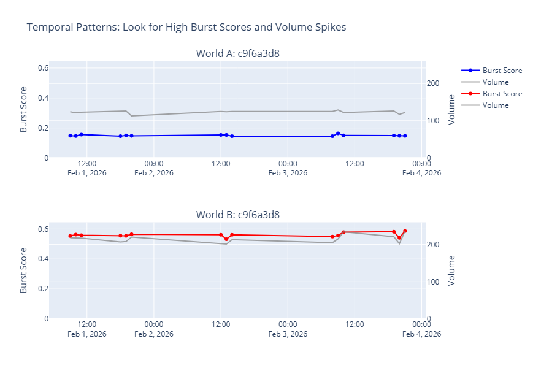
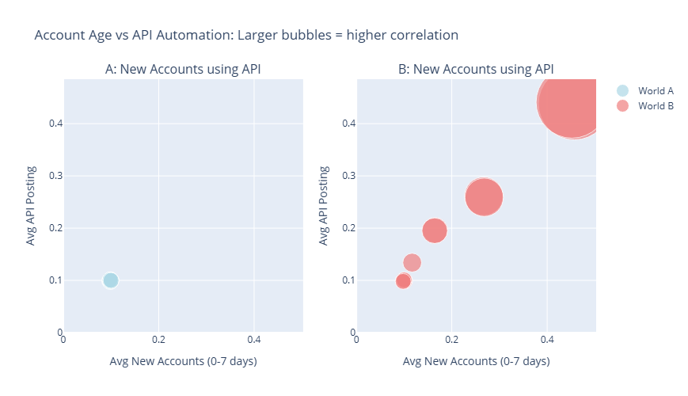

# buzzline-06-world

## From Streaming to Historical Analysis

Streaming data comes in many forms.
We've looked at routing data in motion using Kafka pipelines.
This project is an example of the analytics for a historical review of streaming data.
It's an example of a common concern: once real-time signals are captured, how do analysts detect patterns in the data?

Batch and streaming use much the same detection logic, just in a different context.
Many of our prior tools will be useful in this analysis as well.

## Overview

Two independent worlds are represented in separate DuckDB files (`civic_world_a.duckdb` and `civic_world_b.duckdb`).
Each world provides information about **social media posting behavior**.
To protect privacy, the platform provider doesn't expose the acount holder - or the exact content they posted.
Instead, they implement a "privacy-preserving" API that shares aggregate information.
The public or analytics researchers can access this proposed API to look for indications of possible coordination and/or manipulation.

**Purpose:** Data analysts explore the two worlds of simulated behavior to see if they can detect possible coordination.

## Challenge

1. Analyze `civic_world_a.duckdb` and `civic_world_b.duckdb` using the provided [notebook](./notebooks/analysis.ipynb).
2. Determine which world shows **organic civic discourse** and which world shows **coordinated manipulation**.

## Project Organization

```text
/data/
  /worlds/                 # DuckDB files for analysis
    civic_world_a.duckdb
    civic_world_b.duckdb

/docs/                     # Background information

/notebooks/
  [analysis.ipynb](./notebooks/analysis.ipynb)  # Partially implemented analysis

```

### Prepared Views

These six prepared views help compare the two worlds:

- **View 1:** Compares burst and synchrony across topics
- **View 2:** Examines temporal posting patterns (the "when")
- **View 3:** Analyzes account age and automation correlation
- **View 4:** Measures content coordination (duplication patterns)
- **View 5:** Identifies highest-scoring suspicious events
- **View 6:** Synthesizes all signals for an overall assessment

Each view tests a hypothesis about coordinated vs organic behavior.

## Setup

Standard project setup: see [pro-analytics-01](https://github.com/denisecase/pro-analytics-01) for more detailed instructions.

### CheatSheet: Commands to Manage Virtual Environment

These commands:

1. Create a local project virtual environment in a folder named `.venv`.
2. Activate the virtual environment.
3. Install and upgrade key tools in .venv.
4. Install and upgrade required project dependencies.

<details>
<summary><strong>Windows PowerShell (recommended Option A + requirements.txt)</strong></summary>

```powershell
py -m venv .venv
.\.venv\Scripts\activate
py -m pip install --upgrade pip setuptools wheel
py -m pip install --upgrade -r requirements.txt
```

</details>

<details>
<summary><strong>Windows PowerShell (advanced Option B + pyproject.toml)</strong></summary>

```powershell
uv venv
.\.venv\Scripts\activate
uv pip install --upgrade pip setuptools wheel
uv pip install -e ".[dev]"
```

</details>

<details>
<summary><strong>Mac/Linux/WSL (recommended Option A + requirements.txt)</strong></summary>

```shell
python3 -m venv .venv
source .venv/bin/activate
python3 -m pip install --upgrade pip setuptools wheel
python3 -m pip install --upgrade -r requirements.txt
```

</details>

<details>
<summary><strong>Mac/Linux/WSL (advanced Option B + pyproject.toml)</strong></summary>

```shell
uv venv
source .venv/bin/activate
uv pip install --upgrade pip setuptools wheel
uv pip install -e ".[dev]"
```

</details>

### After Making Useful Changes

Execute notebooks.

```shell
git add .
git commit -m "custom message"
git push -u origin main
```

## Example Analysis Charts

Examples of comparing the social media behavior of the two worlds (without compromising privacy).




